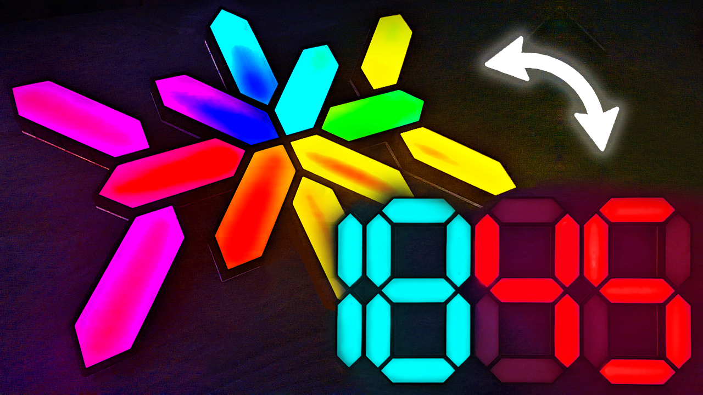

# NanoLeaf

Modular NanoLeaf lights, create any custom shapes, with ability to transform to a 4-digit display made up of 7-segment digits.

There is a [video](https://youtu.be/RalzwaIh_J4) associated with this repository/project, I highly recommend watching it before using this repo.

# Code for any custom NanoLeaf shape

You simply just need to go to [here](https://install.wled.me/), press install and follow the instructions.

# Code for the 4-digit display

Please note, in the video (time: `13:37`) I go through and show the exact steps on how to upload and use the code. Below is just a short text version.

1. Install [VSCode](https://code.visualstudio.com/).
2. In VSCode, install the `PlatformIO IDE` extension.
3. Clone/download this repo.
4. Open the `/WLED` directory in VSCode.
5. There are two changes you need to make before uploading the code:
    - In `WLED/platformio.ini`, under the `[env:esp32dev]` environment, change the `upload_port` to your micro-controller port.
    - In `WLED/usermods/NanoLeaf_Display/usermod_nanoleaf_display.h`, change the `ADDR_LEDS_PER_SEG` variable to the number of addressable LED sections there are in your LED strip. Below is an illustration to explain this further. In the example below, there are 3 sections, since there are 2 cut marks, so if you were to cut the LED strip on the cut marks, you will get 3 seperate sections, this is the number you need to set the `ADDR_LEDS_PER_SEG` variable to.
    - 
6. Now you can upload the code.
7. For the setup you need to do on the phone and how to use the usermod settings to control the 4-digit display, refer to the video (time: `14:42`).

# 3D models

Please refer to the `/3d_printing` directory.

# Wiring

## For any NanoLeaf shape

## For the 4-digit display

### 4-digit display segments wiring

